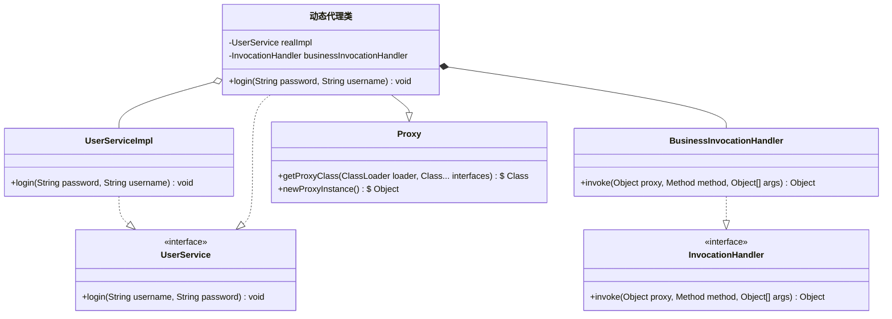

动态代理是 Java 反射的一种使用场景，只要有一个接口，就能在运行时动态生成类型安全的字节码文件，可实现资源延迟加载（同传统代理模式的能力）、切面增强等功能，可以说是 Spring 的基石之一。

这篇文章主要介绍 Java 动态代理的使用，JDK 提供的与动态代理有关的类库等。

<!--more-->

先看下方类图（细节很多，后续讲到相关内容会提示返回来再看）：

- Proxy 和 InvocationHandler 是 JDK 提供的类库
- UserService 和 UserServiceImpl 是被代理的演示代码
- BusinessInvocationHandler 是实现代理逻辑的演示代码
- 最终会生成动态代理类和动态代理实例。



UserService 代码：

```java
public interface UserService {

    /**
     * 一个简单的业务函数，用于演示动态代理
     *
     * @param username username
     * @param password password
     */
    void login(String username, String password);

}
```

UserServiceImpl 代码：

```java
public class UserServiceImpl implements UserService {

    @Override
    public void login(String username, String password) {
        log.info("user {} login", username);
    }

}
```

本文的详细代码可在笔者 Github 的 [JavaTutorials 仓库](https://github.com/cncsl/JavaTutorials/tree/main/reflect)找到。

# 动态代理类

## 获取 Class 对象

```java
Class<?> getProxyClass(ClassLoader loader,Class<?>...interfaces)throws IllegalArgumentException
```

该函数用于创建动态代理类的 Class 对象，动态代理类 Class 对象会使用 loader 指定的类加载器加载、将实现 interfaces 指定的全部接口。

参数 loader 和 interfaces 必须满足以下要求：

- interfaces 中的对象必须都是接口，不能是普通类或基本数据类型。
- interfaces 中不能有重复的接口。
- interfaces 中的所有接口对类加载器 loader 而言都是按名称可见的，用代码体现就是（interface 是参数 interfaces 中某个 Class 对象、loader
  就是对应加载器）： `Class.forName(interface.getName(), false, loader) == interface` 。
- interfaces 中所有的非 public 接口都必须在同一个包路径下，否则无法生成代理类。
- 如果 interfaces 中不同接口内定义了相同签名（函数名和形参列表一致）的方法：
  - 只要有一个方法的返回值类型是 void 或基本数据类型，所有的方法都必须具备相同的返回类型。
  - 其中一个方法的返回值类型必须是其他所有方法返回值类型的子类（或实现类）
- 动态代理类也受虚拟机限制，因此 interfaces 参数长度不能超过 65535。

如果任意条件不满足，会抛出 `IllegalArgumentException` 异常。

## 动态代理类特点

所有的动态代理类都含有以下特点：

- 动态代理类继承 `java.lang.reflect.Proxy` ，自身都是 public、final、非 abstract 的。

- 动态代理类名都以 “$Proxy" 开头，如果 interfaces 中有一个非 public 的接口，生成的动态代理类在该接口的包路径下。

- 动态代理类以固定的顺序（interfaces 的顺序）实现所有接口，如果使用不同的顺序再次调用会生成另一个 Class 对象，使用相同的顺序再次调用会直接返回已有的 Class 对象，用代码体现就是：
  
  ```java
  //interfaces 参数顺序的影响
  Class<?> listSetProxy = Proxy.getProxyClass(ClassLoader.getPlatformClassLoader(), List.class, Set.class);
  Class<?> setListProxy = Proxy.getProxyClass(ClassLoader.getPlatformClassLoader(), Set.class, List.class);
  log.info("listSetProxy hashCode: {}", listSetProxy.hashCode());
  log.info("setListProxy hashCode: {}", setListProxy.hashCode());
  //两个测试都通过
  assertNotEquals(listSetProxy, setListProxy);
  assertEquals(listSetProxy, Proxy.getProxyClass(ClassLoader.getPlatformClassLoader(), List.class, Set.class));
  ```

- `Proxy#isProxyClass` 可用于检查指定的 Class 对象是否为动态代理。

- 动态代理类的实例持由专门的调用处理器接口（InvocationHandler，下方详细介绍）实现组合而成，同时继承 Proxy 类，文章开头的类图也体现了这种关系。

## 创建实例

上文已经提到动态代理类实例由调用处理器组合而成（Proxy 类的 protected 属性），创建实例时必须指定一个调用处理器接口的特定实现。有以下两种方式可以获取一个动态代理实例：

- 获取到对应的 Class 对象后，通过反射的手段创建实例（_升级到 Java 9 之后，Jigsaw 项目给动态代理创建实例的过程带来一点影响，`Proxy#getProxyClass` 已经标记为废弃。_）：
  
  ```java
  //实际使用中，多半是由 Spring 创建
  UserService realImpl = new UserServiceImpl();
  
  Class<?> proxyClass = Proxy.getProxyClass(realImpl.getClass().getClassLoader(), realImpl.getClass().getInterfaces());
  Constructor<?> constructor = proxyClass.getConstructor(InvocationHandler.class);
  UserService instance = (UserService) constructor.newInstance(new BusinessInvocationHandler(realImpl));
  ```

- 如果没有提前获取到 Class 对象，可使用 `Proxy#newProxyInstance` 函数直接创建实例：
  
  ```java
  //实际使用中，多半是由 Spring 创建
  UserService realImpl = new UserServiceImpl();
  
  UserService instance = (UserService) Proxy.newProxyInstance(
    realImpl.getClass().getClassLoader(), realImpl.getClass().getInterfaces(),
    new BusinessInvocationHandler(realImpl)
  );
  ```

# 调用处理器

InvocationHandler 接口中定义了一个函数：

```java
public Object invoke(Object proxy, Method method, Object[]args) throws Throwable;
```

在动态代理实例上调用每个接口定义的函数时，实际都会调用 invoke 函数，将相关信息通过参数传递，具体表现如下：

- 参数 proxy 是动态代理实例自身。
- 参数 method 是定义在接口中、期望调用的函数，在 invoke 函数实现中可以自由选择是否真实调用（回顾一下 ER 图，动态代理类和 InvocationHandler 实现是组合关系，而 UserServiceImpl
  是聚合关系）。
- 参数 args 是传递给 method 的实参，在 invoke 函数实现中可任意使用。
- invoke 函数的返回值会返回给实际调用的函数。
- invoke 函数内抛出的异常也会在实际调用的函数处抛出。
- 在动态代理实例上调用 `toString`, `hashCode` 和`equals` 同样也会传递给 invoke 函数，一般情况下会直接调用被代理实例的相关函数。

假设 BusinessInvocationHandler 实现如下：

```java
public class BusinessInvocationHandler implements InvocationHandler {

    /**
     * 被代理的对象，实际使用中多半是由 Spring 容器注入
     */
    private final UserService service;

    public BusinessInvocationHandler(UserService service) {
        this.service = service;
    }

    @Override
    public Object invoke(Object proxy, Method method, Object[] args) {
        log.info("invoke {}'s {} with args {} start", service.getClass().getSimpleName(), method.getName(), Arrays.toString(args));
        Object result = method.invoke(service, args);
        log.info("invoke {}'s {} with args {} done", service.getClass().getSimpleName(), method.getName(), Arrays.toString(args));
        return result;
    }

}
```

实际使用时代码如下：

```java
//先获取动态代理实例
UserService proxyService=(UserService)Proxy.newProxyInstance(
        realImpl.getClass().getClassLoader(),realImpl.getClass().getInterfaces(),
        new BusinessInvocationHandler(realImpl)
        );
//调用接口函数，观察日志可以发现实际调用了 BusinessInvocationHandler#invoke 函数
        proxyService.login("cncsl","password");
//toString, hashCode 和 equals 也会转发给 invoke，最终 invoke 转给 realImpl 实例
        log.info("dynamicProxyInstance toString: {}, realImpl toString: {}",proxyService,realImpl);
        log.info("dynamicProxyInstance hashCode: {}, realImpl hashCode: {}",proxyService.hashCode(),realImpl.hashCode());
        assertTrue(proxyService.equals(realImpl));
```

# 生成的动态代理类

在 JVM 启动参数中添加以下内容，JVM 会将生成的代理类字节码文件输出到类路径中：

- Java 8 及更早版本：`-Dsun.misc.ProxyGenerator.saveGeneratedFiles=true`
- Java 8 以上版本：`jdk.proxy.ProxyGenerator.saveGeneratedFiles=true`

反编译字节码文件后得到下方源码，笔者添加了一些注释方便理解。

```java
//Java 8以前，动态代理类一般都位于 com.sum.proxy 包路径中（或者实现的非 public 接口的包路径中）
package com.sun.proxy;

import java.lang.reflect.InvocationHandler;
import java.lang.reflect.Method;
import java.lang.reflect.Proxy;
import java.lang.reflect.UndeclaredThrowableException;

import pers.cncsl.jt.reflect.dynamicproxy.UserService;

//继承 Proxy、实现 UserService
public final class $Proxy0 extends Proxy implements UserService {
    // m0~m2 分别是 hashCode、equals 和 toString 方法
    private static Method m0;
    private static Method m1;
    private static Method m2;
    // 被代理接口中定义的方法，本例具体是 UserService 的 login 方法
    private static Method m3;

    //类加载时就初始化
    static {
        try {
            m0 = Class.forName("java.lang.Object").getMethod("hashCode");
            m1 = Class.forName("java.lang.Object").getMethod("equals", Class.forName("java.lang.Object"));
            m2 = Class.forName("java.lang.Object").getMethod("toString");
            m3 = Class.forName("pers.cncsl.jt.reflect.dynamicproxy.UserService").getMethod("login", Class.forName("java.lang.String"), Class.forName("java.lang.String"));
        } catch (NoSuchMethodException var2) {
            throw new NoSuchMethodError(var2.getMessage());
        } catch (ClassNotFoundException var3) {
            throw new NoClassDefFoundError(var3.getMessage());
        }
    }

    //父类构造函数会将 InvocationHandler 实例赋值给 h 属性
    public $Proxy0(InvocationHandler var1) throws {
        super(var1);
    }

    //动态代理类的所有函数都通过掉用处理器工作
    public final int hashCode() throws {
        try {
            return (Integer) super.h.invoke(this, m0, (Object[]) null);
        } catch (RuntimeException | Error var2) {
            throw var2;
        } catch (Throwable var3) {
            throw new UndeclaredThrowableException(var3);
        }
    }

    public final boolean equals(Object var1) throws {
        try {
            return (Boolean) super.h.invoke(this, m1, new Object[]{var1});
        } catch (RuntimeException | Error var3) {
            throw var3;
        } catch (Throwable var4) {
            throw new UndeclaredThrowableException(var4);
        }
    }

    public final String toString() throws {
        try {
            return (String) super.h.invoke(this, m2, (Object[]) null);
        } catch (RuntimeException | Error var2) {
            throw var2;
        } catch (Throwable var3) {
            throw new UndeclaredThrowableException(var3);
        }
    }

    public final void login(String var1, String var2) throws {
        try {
            super.h.invoke(this, m3, new Object[]{var1, var2});
        } catch (RuntimeException | Error var4) {
            throw var4;
        } catch (Throwable var5) {
            throw new UndeclaredThrowableException(var5);
        }
    }

}
```
