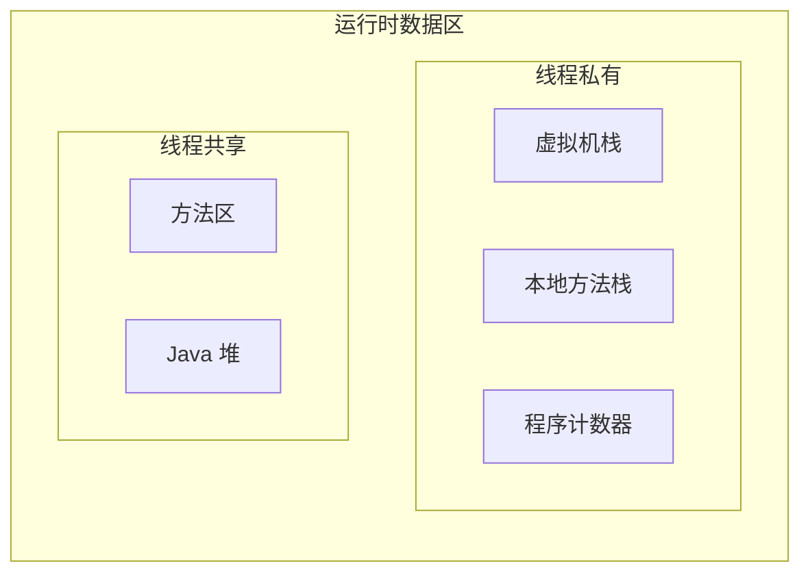

运行时数据区是指对 JVM 运行过程中涉及到的内存根据功能、目的进行的划分。最近在阅读《深入理解 Java 虚拟机》之后终于了解这方面知识，于是写一篇相关内容的学习总结。

<!--more-->

# 运行时数据区

《Java 虚拟机规范》定义中，由 JVM 管理的内存区域分为以下几个运行时数据区域：

## 程序计数器

程序计数器（Program Counter Register）的生命周期和 Java 线程一致，仅能被相关线程访问。用于记录当前线程所执行的字节码的行号，代码中的分支、循环、跳转、异常处理和多线程发生切换时的线程恢复等基础功能都需要依赖程序计数器完成。当执行 Java 代码时，程序计数器存储正在执行的虚拟机字节码指令地址，而执行本地方法时，程序计数器应该为空。

《Java 虚拟机规范》中规定程序计数器不会发生 `OutOfMemoryError` 异常情况。

## 虚拟机栈和本地方法栈

虚拟机栈（Java Virtual Machine Stack）的生命周期和 Java 线程一致，仅能被相关线程访问。用于描述 Java 方法执行的线程内存模型：每次进入一个新的方法时，JVM 都会同步创建一个**栈帧**，栈帧中存储了局部变量表、操作数栈、动态连接和方法出口等信息。每次执行结束一个方法时，对应栈帧就会出栈。

虚拟机栈可能发生两类异常情况：

-   `StackOverflowError`：线程请求的栈深度大于虚拟机允许的深度
-   `OutOfMemoryError`：如果 JVM 栈容量可以动态拓展，当需要拓展时 JVM 无法申请到足够的内存就会抛出该异常。而在 HotSpot 这种不允许动态拓展的虚拟机中，如果创建时就失败依然也会抛出该异常。

本地方法栈（Native Method Stack）与虚拟机栈基本类似，当执行本地方法时使用本地方法栈，同样会抛出 `StackOverflowError` 和 `OutOfMemoryError` 。

《Java 虚拟机规范》对本地方法栈的实现方式没有任何强制规范，故 HotSpot 虚拟机中虚拟机栈和本地方法栈直接合二为一。

虚拟机栈的大小通过 `java` 命令的参数 `-Xss` 设定，

## Java 堆

Java 堆（Java Heap）在虚拟机启动时就创建，虚拟机关闭时销毁，被所有 Java 线程共享。用于存放所有的对象实例。

Java 堆受垃圾回收器管理，由于现代主流的垃圾回收器都是基于分代收集理论设计，Java 堆中经常会出现*“新生代”、“老年代”、“永久代”、“Eden 空间”、“From Survivor 空间”、“To Survivor 空间”* 等名词。这些名词对于 Java 堆的划分，是指一部分垃圾回收器的设计风格，而不是 JVM 具体实现的固有内存布局，更不是 《Java 虚拟机规范》里对 Java 堆的进一步细致划分。并且近年来新出现的垃圾回收器也有不采用分代设计的，再用这些名词划分 Java 堆空间也已经不正确了。

Java 堆可能发生 `OutOfMemoryError`异常：分配内存给新的对象实例失败、且堆无法再拓展时抛出该异常。

Java 堆的大小通过 `java` 命令的参数 `-Xmx` 和 `-Xms` 设定。

## 方法区

方法区（Method Area）和 Java 堆一样在虚拟机启动时就创建，虚拟机关闭时销毁，被所有 Java 线程共享。用于存储已被虚拟机加载的类型信息、常量、静态变量和即时编译器编译后的代码缓存。

在 HotSpot 虚拟机中，方法区的实现经历过两次大规模改动：

0. JDK 6 及以前：为了方便使用分代垃圾收集器管理方法区内存，使用永久代（Permanent Generation）实现方法区。
1. JDK 7 时期：字符串常量池和静态变量转移到本地内存中（Native Memory），其他数据依然存放在由永久代实现的方法区中。
2. JDK 8 及此后：方法区中的全部数据都存放在被称为元空间（Meta-space）的本地内存中。

如果方法区无法满足新的分配内存需求时会抛出 `OutOfMemoryError` 异常。

JDK 8 及此后，HotSpot 提供了两个参数控制元空间的内存大小：

-   `-XX:MaxMetaspaceSize`：设置元空间最大值，默认值 -1 表示不限制。
-   `-XX:MetaspaceSize`：设置元空间初始大小，达到该值时收集器会自动调大（不超过 `-XX:MaxMetaspaceSize` 的前提下）、并触发一次能进行类型卸载的垃圾收集（例如 CMS 收集）。

# 直接内存

直接内存（Direct Memory）并不是虚拟机运行时数据区的一部分，也不是《Java 虚拟机规范》中定义的内存区域，但这部分内存也可能导致 `OutOfMemoryError` 异常。

在 NIO 中有一种基于通道和缓冲区的 I/O 方式，可以通过 native 函数库直接分配堆外内存，然后通过一个存储在 Java 堆里面的 DirectByteBuffer 对象引用操作。因为避免了在 Java 堆和堆外内存中复制数据，能在一些场景中显著提高性能。

直接内存的分配不会收到 Java 堆大小的限制，但总会收到本机总内存大小、处理器寻址空间的限制。例如在 32 位 Windows 操作系统中单个进程的内存上限为 2GB。
