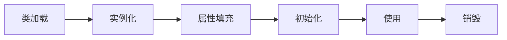
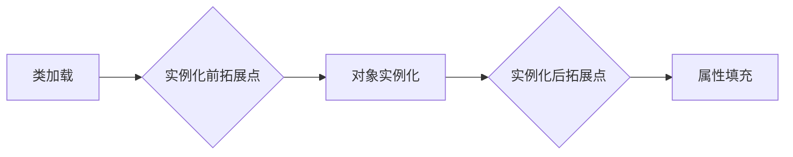
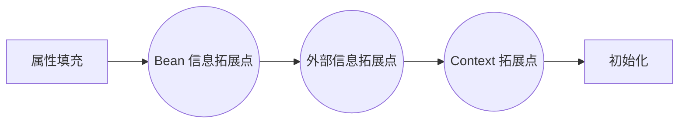
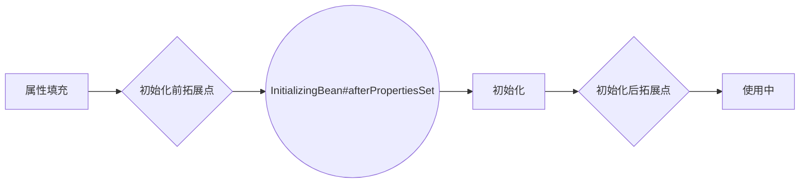
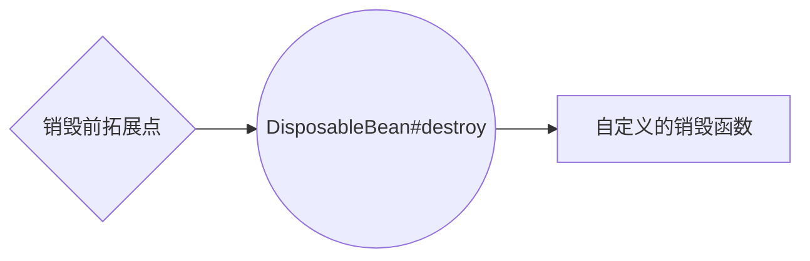
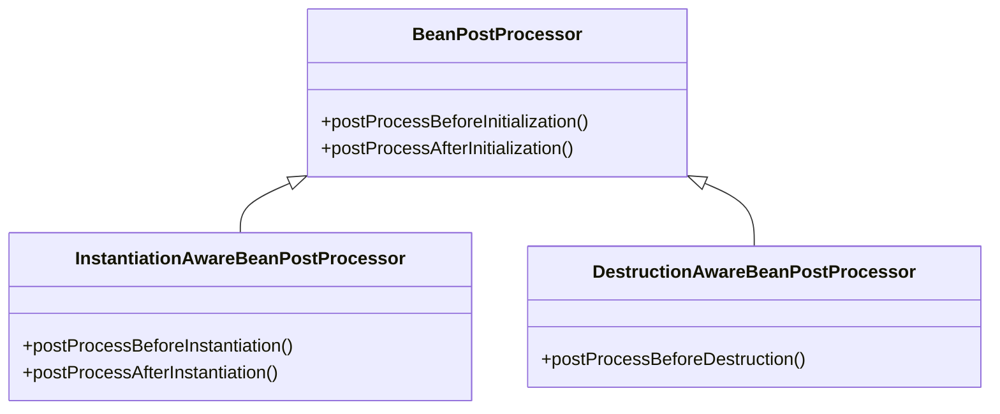

除了使用阶段外，Spring 将 bean 的生命周期定义为实例化、属性填充、初始化和销毁四个阶段，并为每个阶段提供了多个拓展点用于自定义 bean 的创建过程。这篇文章介绍了 bean 的生命周期和其各个拓展点，通过图示生动的展示，并结合一个实例来演示全过程。

<!--more-->

# Spring 生命周期



## 拓展点的类型

Spring 提供的拓展点可以分为：

-   用于单个 bean 的**专用拓展点**：编写 bean 类时通过实现这些接口、重写其中的函数来实现拓展点。Spring 容器会在适当的时候调用这些接口中定义的函数。
    -   诸多 Aware 接口的子接口
    -   `InitializingBean` 接口和 `DisposableBean` 接口
-   用于所有普通 bean 初始化的**通用拓展点**：这些接口中定义了多个拓展点，使用时需要定义一个专门的类实现接口、重写必要的函数。Spring 容器初始化时会将这些类优先注册为 bean，待它们初始化完成之后再初始化普通的 bean。在其他每个普通 bean 注册时，Spring 容器都会尝试调用所有已注册的通用拓展点。
    -   `BeanPostProcessor`
    -   `InstantiationAwareBeanPostProcessor`
    -   `DestructionAwareBeanPostProcessor`

下方出现的图示中，菱形表示**通用拓展点**，而圆形表示**专用拓展点**，矩形就是 bean 的生命周期中的某一步骤。

## 实例化

创建 bean 对象实例的过程，包括使用工厂模式创建和调用构造函数。Spring 通过 `InstantiationAwareBeanPostProcessor` 接口在实例化前和后各提供了两个通用拓展点，加上对象实例化的过程，执行顺序如下：

1. `postProcessBeforeInstantiation`：在普通 bean 对象实例化开始之前调用
2. 对象实例化
3. `postProcessAfterInstantiation`：在普通 bean 对象实例化完成之后调用



## 属性填充

如果对象中有 setter 函数，并通过配置元数据指定了注入的属性，Spring 容器会在这一步为其注入配置的值。完成属性填充后，Spring 通过 Aware（意为**感知**） 接口提供了十个专用拓展点，这些拓展点用于在 bean 自身内部、感知信息和属性校验使用，执行顺序如下（**注意下方列表是第零条是 Bean 属性填充，所以此处一共有十个拓展点**）：

0. Bean 属性填充
1. `BeanNameAware#setBeanName`
2. `BeanClassLoaderAware#setBeanClassLoader`
2. `BeanFactoryAware#setBeanFactory`
3. `EnvironmentAware#setEnvironment`
4. `EmbeddedValueResolverAware#setEmbeddedValueResolver`
5. `ResourceLoaderAware#setResourceLoader`（仅在 ApplicationContext 中有效）
6. `ApplicationEventPublisherAware#setApplicationEventPublisher`（仅在 ApplicationContext 中有效）
8. `MessageSourceAware#setMessageSource`（仅在 ApplicationContext 中有效）
9. `ApplicationContextAware#setApplicationContext`（仅在 ApplicationContext 中有效）
10.  `ServletContextAware#setServletContext`（仅在 WebApplicationContext 中有效）



上方图示中，笔者对拓展点进行了简单的分类以简化图示，第一至第三个拓展点用于感知与 Bean 自身相关的信息、称之为 Bean 信息拓展点，第四至第八个拓展点统称为外部信息拓展点，随后第九第十两个拓展点与 ApplicationContext 有关。

## 初始化

初始化是指通过 bean 在将要工作前进行的最后准备工作，通常是 `@Bean` 的`initMethod` 属性定义的函数执行的过程 。Spring 通过 `BeanPostProcessor` 接口在初始化之前和之后提供了两个通用拓展点，加上 `InitializingBean#afterPropertiesSet`  和初始化函数执行顺序为：

1. `postProcessBeforeInitialization`
2. `InitializingBean#afterPropertiesSet`
3. 自定义的初始化函数
4. `postProcessAfterInitialization`




## 销毁

销毁是指 bean 释放其占用的一些外部资源的过程，通常是 `@Bean` 注解的 `destroyMethod` 属性定义的销毁函数执行的过程。Spring 通过 `DestructionAwareBeanPostProcessor#postProcessBeforeDestruction` 接口提供了通用拓展点，再加上 `DisposableBean#destroy` 提供的专用拓展点，三者执行顺序为：

1. `DestructionAwareBeanPostProcessor#postProcessBeforeDestruction`
2. `DisposableBean#destroy`
3. 自定义的销毁函数。



## 总结

Spring 提供的拓展点令人眼花缭乱，但仔细思考就会发现这些内容设计的很好。以下是笔者的一些总结：

- 通用拓展点可以对任意其他的类进行处理，且各个通用拓展点实际都来自于 `BeanPostProcessor`，本文中提到的三个拓展点类图如下（也就是说 `InstantiationAwareBeanPostProcessor` 接口的实现类如果实现了 `postProcessBeforeInitialization` 函数，其实也具备初始化前置拓展点的能力）。此外，实例化 *Instantiation* 和初始化 *Initialization* 这两个单词的拼写需要区分以下。




- 属性填充阶段的多个拓展点可以根据其用途进行分类便于记忆

- *自定义的初始化方法和自定义的销毁方法可以认为是一对*，*`InitializingBean` 接口和 `DisposableBean` 接口可以认为是一对*，它们之间不应该交叉出现（例如通过自定义的初始化方法定义了初始化过程，却通过 `DispoableBean#destory` 执行销毁过程）。

# 实例演示

一个简单的演示，实现了上文提到的 bean 生命周期全部的拓展点，通过日志打印的方式观察执行顺序来直观的感受。是一个普通的 SpringBoot Hello World 程序，将 Logback 换成了 log4j2 以更方便的定义日志内容，降低解析结果的难度。

## 在一个 bean 中实现全部的专用拓展点

SimpleBean 类

```java

/**
 * 一个简单的 bean 实例，实现了 Spring 提供的 bean 生命周期全拓展点，内部函数实现顺序即为 bean 生命周期中各个函数的调用顺序
 */
@Log4j2(topic = "SimpleBean")
public class SimpleBean
        implements BeanNameAware, BeanClassLoaderAware, BeanFactoryAware,
        EnvironmentAware, EmbeddedValueResolverAware, ResourceLoaderAware,
        ApplicationEventPublisherAware, MessageSourceAware, ApplicationContextAware, InitializingBean, DisposableBean {

    private EmptyBean emptyBean;

    public SimpleBean() {
        log.info("构造函数执行，创建实例");
    }

    @Autowired
    public void setEmptyBean(EmptyBean emptyBean) {
        this.emptyBean = emptyBean;
        log.info("setter 函数执行，装配了 {}", this.emptyBean);
    }

    /** 用于通知 bean 感知自身名称 */
    @Override
    public void setBeanName(String name) {
        log.info("bean 名称为 {}", name);
    }

    /** 用于通知 bean 感知加载自身的类加载器 */
    @Override
    public void setBeanClassLoader(ClassLoader classLoader) {
        log.info("类加载器是 {}", classLoader);
    }

    /** 用于通知 bean 感知创建自身的 bean 工厂 */
    @Override
    public void setBeanFactory(BeanFactory beanFactory) throws BeansException {
        //BeanFactory 可能会重写 toString()，造成日志输出过多不便于查阅
        log.info("由 {}@{} 创建", beanFactory.getClass(), beanFactory.hashCode());
    }

    /** 设置该 bean 的运行环境信息 */
    @Override
    public void setEnvironment(Environment environment) {
        //environment.toString() 会将所有环境信息输出，造成日志输出过多不便于查阅
        log.info("运行的 JVM 型号是 {}", environment.getProperty("java.vm.name"));
    }

    /** 设置嵌入式配置解析器，可用于解析嵌入在应用程序包内的配置文件中的文本值 */
    @Override
    public void setEmbeddedValueResolver(StringValueResolver resolver) {
        //在 application.properties 中定义了 editor.name 信息
        log.info("作者是 {}", resolver.resolveStringValue("${editor.name}"));
    }

    /** 设置用于资源解析的解析器，可用于解析任意格式的资源 */
    @Override
    public void setResourceLoader(ResourceLoader resourceLoader) {
        log.info("资源解析器对象：{}", resourceLoader);
    }

    /** 设置事件发布器，与 Spring 提供的事件发布订阅机制有关 */
    @Override
    public void setApplicationEventPublisher(ApplicationEventPublisher applicationEventPublisher) {
        log.info("事件发布器对象：{}", applicationEventPublisher);
    }

    /** 设置消息原，可用于实现国际化 */
    @Override
    public void setMessageSource(MessageSource messageSource) {
        log.info("消息源对象：{}", messageSource);
    }

    /** 为当前 bean 传入 ApplicationContext 引用，可使用该容器引用获取其他 bean 的引用 */
    @Override
    public void setApplicationContext(ApplicationContext applicationContext) throws BeansException {
        log.info("应用程序上下文对象：{}", applicationContext.getDisplayName());
    }

    /** 在初始化前拓展点执行完成后执行 */
    @Override
    public void afterPropertiesSet() {
        log.info("属性装配全部完成，校验无误，开始初始化");
    }

    /** 自定义的初始化方法 */
    public void initMethod() {
        log.info("自定义的初始化方法");
    }

    /** 容器销毁时调用 */
    @Override
    public void destroy() {
        log.info("容器即将关闭，销毁其中的 bean");
    }

    /** 自定义的销毁方法 */
    public void destroyMethod() {
        log.info("自定义的销毁方法");
    }

}
```

EmptyBean 类

```java
/** 一个空的 bean，用于在 SimpleBean 中进行 setter 注入 */
@Component
public class EmptyBean {
}
```

## 自定义三种类型的通用拓展点

### 实例化处理器

```java
@Log4j2(topic = "CustomInstantiationProcessor")
@Component
public class CustomInstantiationProcessor implements InstantiationAwareBeanPostProcessor {

    public CustomInstantiationProcessor() {
        log.info("InstantiationAwareBeanPostProcessor 优先初始化");
    }

    /** 其他 bean 实例化之前调用 */
    @Override
    public Object postProcessBeforeInstantiation(Class<?> beanClass, String beanName) throws BeansException {
        if (beanClass.equals(SimpleBean.class)) {
            log.info("{} 即将实例化", beanName);
        }
        return null;
    }

    /** 其他 bean 实例化之后调用 */
    @Override
    public boolean postProcessAfterInstantiation(Object bean, String beanName) throws BeansException {
        if (bean instanceof SimpleBean) {
            log.info("{} 实例化完成", beanName);
        }
        return true;
    }

}
```

### 初始化处理器

```java
@Log4j2(topic = "CustomInitializationProcessor")
@Component
public class CustomInitializationProcessor implements BeanPostProcessor {

    public CustomInitializationProcessor() {
        log.info("BeanPostProcessor 优先初始化");
    }

    /** 其他 bean 初始化之前调用 */
    @Override
    public Object postProcessBeforeInitialization(Object bean, String beanName) throws BeansException {
        if (bean instanceof SimpleBean) {
            log.info("{} 即将初始化", beanName);
        }
        return bean;
    }

    /** 其他 bean 初始化完成之后调用 */
    @Override
    public Object postProcessAfterInitialization(Object bean, String beanName) throws BeansException {
        if (bean instanceof SimpleBean) {
            log.info("{} 初始化完成", beanName);
        }
        return bean;
    }
}
```

### 销毁处理器

```java
@Log4j2(topic = "CustomDestructionProcessor")
@Component
public class CustomDestructionProcessor implements DestructionAwareBeanPostProcessor {

    public CustomDestructionProcessor() {
        log.info("DestructionAwareBeanPostProcessor 优先初始化");
    }

    /** 其他 bean 销毁之前调用 */
    @Override
    public void postProcessBeforeDestruction(Object bean, String beanName) throws BeansException {
        if (bean instanceof SimpleBean) {
            log.info("{} 即将销毁", beanName);
        }
    }

}
```

## 入口类

```java
@Log4j2(topic = "DemoApplication")
@SpringBootApplication
public class DemoApplication implements CommandLineRunner {

    private SimpleBean bean;

    @Bean(initMethod = "initMethod", destroyMethod = "destroyMethod")
    public SimpleBean simpleBean() {
        return new SimpleBean();
    }

    @Autowired
    public void setBean(SimpleBean bean) {
        this.bean = bean;
    }

    public static void main(String[] args) {
        SpringApplication.run(DemoApplication.class, args);
    }

    @Override
    public void run(String... args) {
        log.info("{} 使用", bean);
    }

}
```

## 结果解析

日志格式定义：`logging.pattern.console=[%t] %c %M : %m %n`，下方是逐阶段的分析。

0. SpringBoot 启动，初始化容器

1. 优先加载 `BeanPostProcessor` 的实现类

    ```text
    [main] CustomInstantiationProcessor <init> : InstantiationAwareBeanPostProcessor 优先初始化
    [main] CustomInitializationProcessor <init> : BeanPostProcessor 优先初始化
    [main] CustomDestructionProcessor <init> : DestructionAwareBeanPostProcessor 优先初始化
    ```

2. 实例化阶段的日志

    ```text
    [main] CustomInstantiationProcessor postProcessBeforeInstantiation : simpleBean 即将实例化
    [main] SimpleBean <init> : 构造函数执行，创建实例
    [main] CustomInstantiationProcessor postProcessAfterInstantiation : simpleBean 实例化完成
    ```

3. 属性填充阶段的日志

    ```text
    [main] SimpleBean setEmptyBean : setter 函数执行，装配了 cncsl.learn.blc.EmptyBean@2f67a4d3
    [main] SimpleBean setBeanName : bean 名称为 simpleBean
    [main] SimpleBean setBeanClassLoader : 类加载器是 org.springframework.boot.loader.LaunchedURLClassLoader@51565ec2
    [main] SimpleBean setBeanFactory : 由 class org.springframework.beans.factory.support.DefaultListableBeanFactory@797814020 创建
    [main] SimpleBean setEnvironment : 运行的 JVM 型号是 Java HotSpot(TM) 64-Bit Server VM
    [main] SimpleBean setEmbeddedValueResolver : 作者是 cncsl
    [main] SimpleBean setResourceLoader : 资源解析器对象：org.springframework.context.annotation.AnnotationConfigApplicationContext@ba2f4ec
    [main] SimpleBean setApplicationEventPublisher : 事件发布器对象：org.springframework.context.annotation.AnnotationConfigApplicationContext@ba2f4ec
    [main] SimpleBean setMessageSource : 消息源对象：org.springframework.context.annotation.AnnotationConfigApplicationContext@ba2f4ec
    [main] SimpleBean setApplicationContext : 应用程序上下文对象：org.springframework.context.annotation.AnnotationConfigApplicationContext@ba2f4ec
    ```

4. 初始化阶段

    ```text
    [main] CustomInitializationProcessor postProcessBeforeInitialization : simpleBean 即将初始化
    [main] SimpleBean initMethod : 自定义的初始化方法
    [main] SimpleBean afterPropertiesSet : 属性装配全部完成，校验无误，开始初始化
    [main] CustomInitializationProcessor postProcessAfterInitialization : simpleBean 初始化完成
    [main] cncsl.learn.blc.DemoApplication logStarted : Started DemoApplication in 0.817 seconds (JVM running for 1.219)
    [main] DemoApplication run : cncsl.learn.blc.SimpleBean@295cf707 使用
    ```

5. 使用阶段

    ```text
    [main] cncsl.learn.blc.DemoApplication logStarted : Started DemoApplication in 1.135 seconds (JVM running for 2.028)
    [main] DemoApplication run : cncsl.learn.blc.SimpleBean@4a335fa8 使用
    ```

6. 销毁阶段

    ```text
    [SpringContextShutdownHook] CustomDestructionProcessor postProcessBeforeDestruction : simpleBean 即将销毁
    [SpringContextShutdownHook] SimpleBean destroyMethod : 自定义的销毁方法
    [SpringContextShutdownHook] SimpleBean destroy : 容器即将关闭，销毁其中的 bean
    ```
